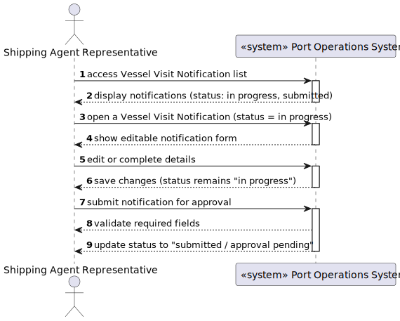

## 3. Design

### 3.1. System Sequence Diagram (SSD)

---

### 3.2. Interaction Responsibility Assignment — US 2.2.9 (Edit or Submit Vessel Visit Notification)

| Interaction Step                                                       | Question: Which class is responsible for…     | Class                                | Justification (with patterns)                                                                 |
|------------------------------------------------------------------------|-----------------------------------------------|--------------------------------------|-----------------------------------------------------------------------------------------------|
| Step 1: Shipping Agent requests to edit or submit a visit notification | Handling user input and sending the request   | `Swagger`                            | **Pure Fabrication:** Manages interaction and delegates actions to backend API endpoints.     |
| Step 2: API receives PUT request for update or submission              | Coordinating actions between layers           | `VesselVisitNotificationsController` | **Controller:** Receives request and delegates to application service layer.                  |
| Step 3: Retrieve existing notification and apply changes               | Managing business rules and state transitions | `VesselVisitNotificationService`     | **Information Expert:** Contains rules for edit and submission flows and status validation.   |
| Step 4: Ensure valid state transition (InProgress → Submitted)         | Enforcing domain consistency                  | `VesselVisitNotification` (Entity)   | **Entity / Information Expert:** Manages internal state transitions and validation logic.     |
| Step 5: Persist updated notification data                              | Saving domain objects and state changes       | `IVesselVisitNotificationRepository` | **Repository Pattern:** Handles persistence logic, isolating data access from business logic. |
| Step 6: Commit transaction to the database                             | Managing transaction boundaries               | `UnitOfWork`                         | **Unit of Work:** Ensures all updates and submissions are saved atomically.                   |
| Step 7: Return response with updated or submitted notification data    | Sending confirmation message back to user     | `Swagger`                            | **Pure Fabrication:** Displays operation results and API responses to the end-user.           |

### 3.3. Sequence Diagram (SD)

---
---

### 3.4. SOLID Principles

| Principle                                     | Application                                                                         | Explanation                               |
|-----------------------------------------------|-------------------------------------------------------------------------------------|-------------------------------------------|
| **S – Single Responsibility Principle (SRP)** | `VesselVisitNotificationController` focuses on coordination.                        | UI, logic, and persistence are separated. |
| **O – Open/Closed Principle (OCP)**           | New notification states or validations can be added without changing existing code. | Extensible design.                        |
| **L – Liskov Substitution Principle (LSP)**   | `IVesselVisitNotificationRepository` can be substituted by any implementation.      | Enables flexible persistence.             |
| **I – Interface Segregation Principle (ISP)** | Repositories and services expose minimal required operations.                       | Prevents unnecessary coupling.            |
| **D – Dependency Inversion Principle (DIP)**  | High-level modules depend on abstractions (`IVesselVisitNotificationRepository`).   | Promotes testability and modularity.      |

---

### 3.5. GoF Patterns

| Pattern                          | Usage                                                                | Explanation                                       |
|----------------------------------|----------------------------------------------------------------------|---------------------------------------------------|
| **Controller**                   | `VesselVisitNotifiationController` coordinates UI and services.      | Mediates between presentation and domain.         |
| **Repository**                   | `IVesselVisitNotificationRepository` handles persistence operations. | Abstracts database access.                        |
| **Information Expert**           | `VesselVisitNotification` contains its validation and state logic.   | Encapsulates its own data and behavior.           |
| **Pure Fabrication**             | Utilization of `Dtos` exist for technical separation of concerns.    | SImproves maintainability and testability.        |
| **Low Coupling / High Cohesion** | Clear separation between layers and well-defined responsibilities.   | Reduces interdependencies and increases cohesion. |

---
