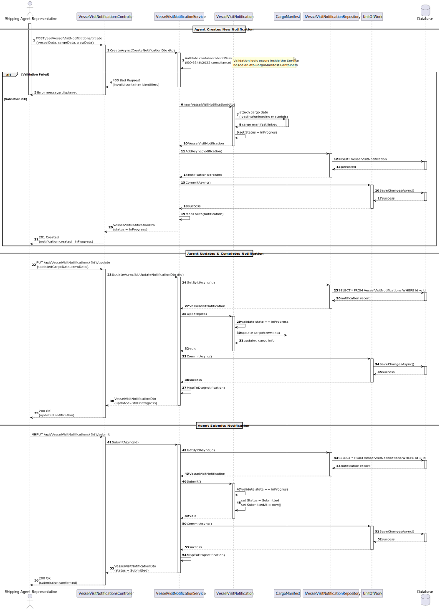

## 3. Design

### 3.1. System Sequence Diagram (SSD)

---

### 3.2. Class Diagram (Conceptual)

**VesselVisitNotification**

- id, vesselId, ETA, ETD, status, cargoManifest, crewInfo

**CargoManifest**

- type (loading/unloading), containerList

**Container**

- id (ISO 6346), description, bay, row, tier

**CrewMember**

- name, citizenId, nationality, role

**Relationship:**  
`VesselVisitNotification 1 — 0..* CargoManifest`  
`VesselVisitNotification 1 — 0..* CrewMember`

---

### 3.3. Interaction Responsibility Assignment

| Interaction Step                                     | Question: Which class is responsible for…      | Class                             | Justification (with patterns)                                               |
|------------------------------------------------------|------------------------------------------------|-----------------------------------|----------------------------------------------------------------------------|
| Step 1: Agent initiates notification                 | Handling user input and triggering the process | `SubmitVesselVisitUI`             | **Pure Fabrication:** Manages interaction and delegates to controller.     |
| Step 2: UI forwards the submission request           | Coordinating business logic                    | `SubmitVesselVisitController`     | **Controller:** Coordinates actions and delegates to application services. |
| Step 3: Data validation and persistence              | Validating input and executing business rules  | `SubmitVesselVisitService`        | **Information Expert:** Centralizes the business logic.                    |
| Step 4: Persisting data                              | Saving notification and cargo/crew details     | `IVesselVisitRepository`          | **Repository Pattern:** Handles data persistence logic.                    |
| Step 5: Feedback to user                             | Showing success message                        | `SubmitVesselVisitUI`             | **Pure Fabrication:** Manages user interaction and result display.         |

---

### 3.4. Sequence Diagram

---

### 3.5. SOLID Principles

| Principle                                     | Application in US_2.2.8                                                                              | Explanation                                         |
|----------------------------------------------|------------------------------------------------------------------------------------------------------|-----------------------------------------------------|
| **S – Single Responsibility Principle (SRP)** | `SubmitVesselVisitController` handles only coordination of business logic.                          | Keeps UI, logic, and persistence separated.         |
|                                              | `SubmitVesselVisitService` validates and processes business rules.                                  | Focused solely on notification logic.               |
|                                              | `VesselVisitNotification` encapsulates domain logic.                                                 | Isolates business entities from infrastructure.     |
| **O – Open/Closed Principle (OCP)**           | Services and domain classes can be extended with new validations without changing existing logic.    | Allows extensibility with minimal modification.     |
| **L – Liskov Substitution Principle (LSP)**   | `IVesselVisitRepository` can be replaced by any implementation (e.g., SQL, in-memory).               | Promotes interchangeable components.                |
| **I – Interface Segregation Principle (ISP)** | Interfaces like `IVesselVisitRepository` are focused on essential operations (`save`, `findById`).   | Prevents unnecessary dependencies.                  |
| **D – Dependency Inversion Principle (DIP)**  | The controller depends on abstractions (`IVesselVisitRepository`).                                   | Promotes decoupling and enables testing with mocks. |

---

### 3.6. GoF Patterns

| Pattern                          | Usage in US_2.2.8                                                                                     | Explanation                                       |
|----------------------------------|--------------------------------------------------------------------------------------------------------|---------------------------------------------------|
| **Controller**                   | `SubmitVesselVisitController` coordinates the flow between UI, domain, and persistence.               | Acts as mediator between layers.                  |
| **Repository**                   | `IVesselVisitRepository` encapsulates persistence operations.                                          | Abstracts database access.                        |
| **Information Expert**           | `VesselVisitNotification`, `CargoManifest`, and `Container` contain their own validation logic.       | Domain entities hold relevant knowledge.          |
| **Pure Fabrication**             | `SubmitVesselVisitUI` exists for technical separation of concerns.                                     | Improves maintainability and testability.         |
| **Low Coupling / High Cohesion**| Clear separation between layers and well-defined responsibilities.                                     | Reduces interdependencies and increases cohesion. |

---