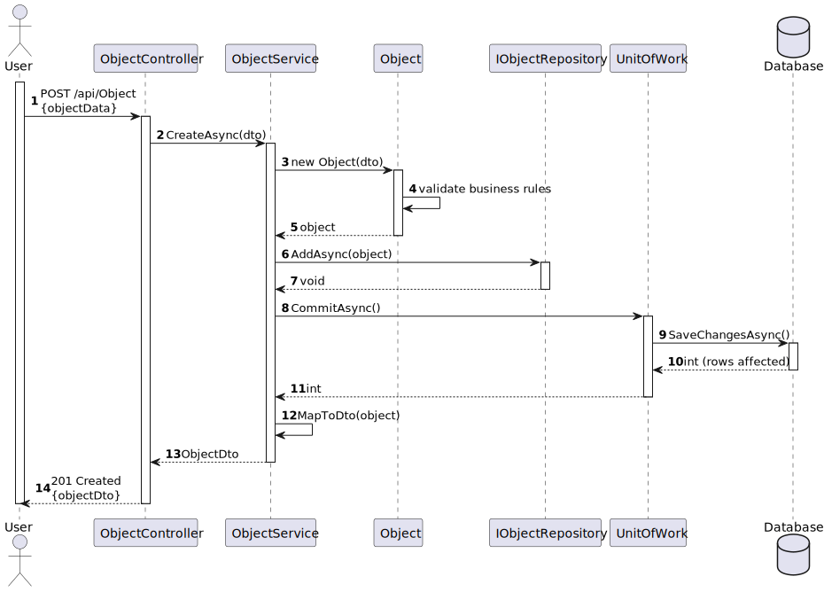
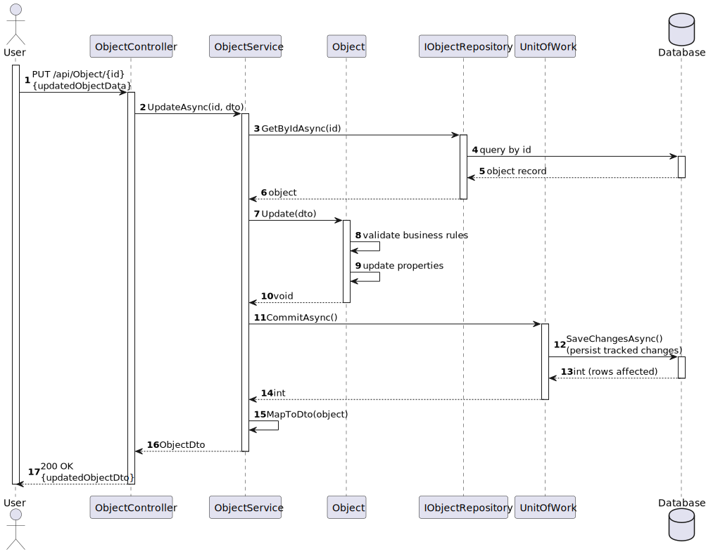

## 3. Design

### 3.1. System Sequence Diagram (SSD)

---

### 3.2. Interaction Responsibility Assignment

| Interaction Step | Question: Which class is responsible for… | Class / Method | Justification (with patterns) |
|------------------|-------------------------------------------|----------------|------------------------------|
| Step 1: Operator requests create/update/deactivate staff | Which class handles the HTTP request? | `StaffMembersController` | Controller — HTTP entry point; delegates to service. |
| Step 2: Controller forwards the request | Which class coordinates business rules and orchestration? | `StaffMemberService` | Service — coordinates repository calls and domain operations. |
| Step 3: Validate uniqueness (mecanographic number) | Which class verifies data constraints against storage? | `IStaffMemberRepository` / `StaffMemberRepository` | Repository — performs data queries and uniqueness checks. |
| Step 4: Create/update staff entity | Which class owns staff data and behavior? | `StaffMember` (aggregate) | Aggregate root / Information Expert — enforces invariants and state changes. |
| Step 5: Add / remove qualifications | Which class updates qualifications and enforces rules? | `StaffMemberService` + `StaffMember.AddQualification()` / `RemoveQualification()` | Service orchestrates; aggregate mutates and validates (Service + Information Expert). |
| Step 6: Persist changes | Which classes commit data to the DB? | `IStaffMemberRepository` + `UnitOfWork.CommitAsync()` | Repository + Unit of Work — encapsulate persistence and transactions. |
| Step 7: Query / search staff members | Which class exposes filtering and search? | `StaffMemberRepository` | Repository — provides search/filter operations. |
| Step 8: Feedback to operator | Which class returns HTTP responses? | `StaffMembersController` | Controller — maps service results to HTTP responses. |

---

### 3.3. Sequence Diagram

### 3.4. SOLID Principles

| Principle | Application in US_2.2.11 | Explanation |
|-----------|-------------------------|-------------|
| S – Single Responsibility Principle (SRP) | `StaffMembersController` — HTTP layer; `StaffMemberService` — application logic; `StaffMember` — domain rules; `IStaffMemberRepository` — persistence | Each type has one clear responsibility. |
| O – Open/Closed Principle (OCP) | `StaffMemberService` and `StaffMember` are open for extension (new rules/qualifications) without modifying callers | Add behavior via new methods or subclasses without changing existing code. |
| L – Liskov Substitution Principle (LSP) | `IStaffMemberRepository` implementations (EF Core, in-memory) are interchangeable in tests and runtime | Repositories can be swapped without breaking clients. |
| I – Interface Segregation Principle (ISP) | Small interfaces (`IStaffMemberRepository`, DTOs for create/update) keep clients focused | Consumers depend only on required methods. |
| D – Dependency Inversion Principle (DIP) | High-level modules depend on abstractions (`IStaffMemberRepository`, `IQualificationRepository`) injected in `StaffMemberService` | Enables decoupling and easier testing (mocks/stubs). |

---

### 3.5. GoF Patterns

| Pattern | Usage in US_2.2.11 | Explanation |
|---------|-------------------|-------------|
| Controller | `StaffMembersController` — exposes REST endpoints and delegates to service | Separates transport concerns from business logic. |
| Repository | `StaffMemberRepository` / `IStaffMemberRepository` — encapsulate data access and queries | Hides persistence details; provides collection-like API to domain. |
| Information Expert | `StaffMember` aggregate — implements validation and qualification management | Behavior placed next to the data that owns it. |
| State Pattern (optional) | `MemberStatus` (Available / Unavailable) models lifecycle; state pattern can further isolate per-state behavior | Useful if per-state behavior grows complex. |
| Strategy (optional) | Search and filter logic (search by name/status/qualification) can be extracted as strategies | Enables pluggable query strategies for flexibility. |
| Low Coupling / High Cohesion | Controller → Service → Repository separation with DI and focused interfaces | Keeps modules focused and easy to test/change. |

---