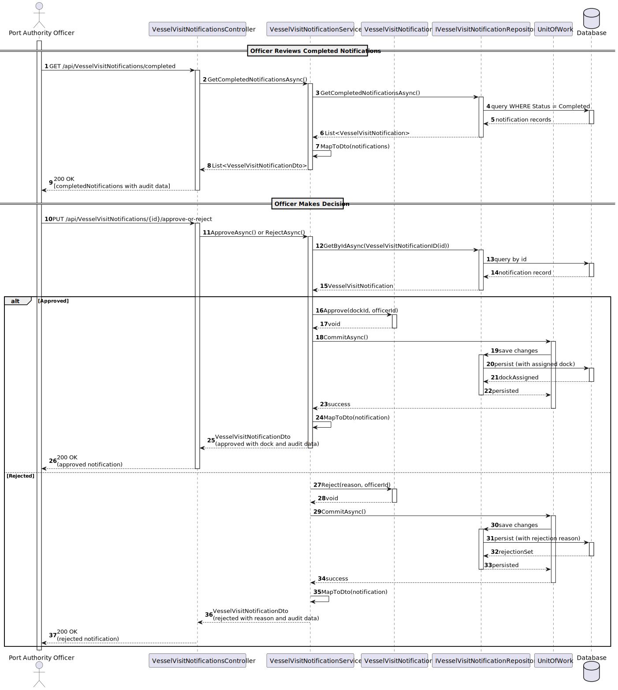

## 3. Design

### 3.1. System Sequence Diagram (SSD)

---

### 3.2. Interaction Responsibility Assignment

| Interaction Step | Question: Which class is responsible for… | Class / Method | Justification (with patterns) |
|------------------|-------------------------------------------|----------------|------------------------------|
| Step 1: Officer requests to review pending notifications | Which class handles the HTTP request to list completed notifications? | `VesselVisitNotificationsController.GetCompletedNotifications()` | Controller — HTTP entry point; delegates to service (Controller pattern). |
| Step 2: Retrieve completed notifications | Which class orchestrates retrieval and mapping to DTOs? | `VesselVisitNotificationService.GetCompletedNotificationsAsync()` | Service — coordinates repository + mapping (Service / Facade). |
| Step 3: Officer selects notification and sends decision (approve/reject) | Which class receives the approve/reject HTTP call? | `VesselVisitNotificationsController.Approve(...)` / `Reject(...)` | Controller — validates input and forwards to service. |
| Step 4: Apply business rules to the decision | Which class applies rules and state transitions? | `VesselVisitNotificationService.ApproveAsync()` / `RejectAsync()` | Service — loads aggregate and invokes domain behavior (Domain Service). |
| Step 5: Assign dock (approved) / record reason (rejected) | Which class updates aggregate state and attributes? | `VesselVisitNotification.Approve()` / `Reject()` | Aggregate root — owns state & transitions (Information Expert). |
| Step 6: Record decision metadata (timestamp, officerId, outcome) | Which class stores audit metadata? | Properties on `VesselVisitNotification` | Aggregate — stores audit fields on the entity (in-place audit). |
| Step 7: Persist changes | Which classes handle persistence and committing? | `IVesselVisitNotificationRepository` + `UnitOfWork.CommitAsync()` | Repository + Unit of Work — encapsulate DB ops and transactions. |
| Step 8: Notify shipping agent (if needed) | Which class sends external notifications? | (not implemented) suggested `INotificationService` | Infrastructure service — external calls separated from domain (Pure Fabrication). |
| Step 9: Feedback to officer (HTTP response) | Which class formats and returns the HTTP response? | `VesselVisitNotificationsController` | Controller — maps domain result to HTTP response. |

---

### 3.3. Sequence Diagram

### 3.4. SOLID Principles

| Principle | Application in US_2.2.7 | Explanation |
|-----------|-------------------------|-------------|
| S – Single Responsibility Principle (SRP) | Controller: `ReviewVesselVisitNotificationController` — handles HTTP and delegates. Service: `VesselVisitNotificationService` — handles business rules. Entity: `VesselVisitNotification` — holds state and behavior. | Each class has one clear responsibility. |
| O – Open/Closed Principle (OCP) | Services and the domain entity can be extended with new rules; `IVesselVisitNotificationRepository` supports different persistence implementations. | Extend behavior without modifying existing code. |
| L – Liskov Substitution Principle (LSP) | Different `IVesselVisitNotificationRepository` implementations (EF Core, in-memory) can replace each other. | Substitutions keep expected behavior. |
| I – Interface Segregation Principle (ISP) | Use small, focused interfaces (`IVesselVisitNotificationRepository`, `IUnitOfWork`) that expose specific operations. | Clients depend only on the methods they use. |
| D – Dependency Inversion Principle (DIP) | High-level modules depend on abstractions (repositories, unit of work, notification service). | Low-level details can be swapped without changing high-level code. |

---

### 3.5. GoF Patterns

| Pattern | Usage in US_2.2.7 | Explanation |
|---------|------------------|-------------|
| Controller | `VesselVisitNotificationsController` handles HTTP endpoints and delegates to services. | Separates HTTP concerns from business logic. |
| Repository | `VesselVisitNotificationRepository` encapsulates database access. | Hides persistence and provides a collection-like interface to the domain. |
| Information Expert | `VesselVisitNotification` implements domain rules (approve, reject, assign dock). | Puts behavior next to the data that owns it. |
| Audit | Decision metadata (timestamp, officerId, outcome) is stored on `VesselVisitNotification`. | The aggregate stores audit fields as part of its state. |
| State Pattern (optional) | The aggregate models state transitions; the State Pattern can isolate per-state behavior when needed. | Simplifies conditional logic across states. |
| Low Coupling / High Cohesion | Separation Controller → Service → Repository with DI and focused interfaces. | Modules remain focused and easy to test and change. |

---